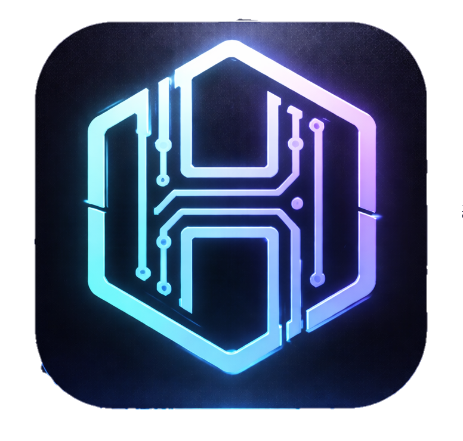

<div align="center">
  
  
  # 💠 HexMind v2.5 (The Singularity Update)
  
  **The World's Most Advanced Autonomous AI Hacking Collective**

  [](https://)
  [](https://)
  [](https://)

  <br>

  <a href="https://hexmind.space/">
    
  </a>
  <a href="https://hexmind.space/docs.html">
    
  </a>

  <br><br>
  
  <p align="center">
    <b>HexMind</b> is an elite, multi-agent autonomous framework designed for high-stakes cybersecurity operations. <br>
    It doesn't just answer questions—it <b>thinks, plans, executes, and learns</b> in real-time.
  </p>

</div>

---

## 🚀 The V2.5 God-Mode Evolution

HexMind v 2.5 introduces **The Singularity Engine**, transforming the assistant into a fully distributed, visual-aware, self-healing hacking collective.

### 🛡️ Autonomous Recon & Defense
- **🎯 24/7 Bounty Hunter**: Continuous background recon daemon for wildcard domains. Discovers subdomains via crt.sh and probes for vulnerabilities while you sleep.
- **🧬 AST Exploit Mutator**: Automatically crafts polymorphic WAF-bypass payloads using mathematical obfuscation and polyglot encoding.
- **📡 Zero-Day Sentinel**: Real-time log monitoring with AI anomaly detection to catch zero-day exploits as they hit your infrastructure.

### 👁️ Visual Hacking & Research
- **👁️ Vision Sandbox Attacker**: Powered by **Playwright & Gemini 2.5 Pro**. HexMind opens an invisible browser, "sees" the UI, bypasses logical captchas, and identifies attack surfaces visually.
- **🔍 o3-Level Deep Research**: Multi-step internet-scale research loop. It brainstorms queries, scrapes multiple sources, and synthesizes massive intelligence reports autonomously.
- **🕵️ File Surfer**: Autonomous local filesystem navigation to find configuration secrets, tokens, and misconfigurations without human guidance.

### 🔌 Distributed Intelligence
- **🐝 Swarm Architecture**: Distributed P2P networking. Connect multiple HexMind nodes (Raspberry Pi, VPS, Laptop) to a Master node and distribute heavy workloads like wordlist cracking at 5x speed.
- **🔌 Omni-API Integration**: Conversational OSINT. Ask HexMind about any IP, phone number, or domain—it autonomously formulates RapidAPI calls to fetch real-time global intelligence.

---

## 📦 Installation & Setup

HexMind is cross-platform and works flawlessly on **Windows, Linux, and Termux (Android)**.

### 💻 Standard Install (Windows/Linux)
```bash
git clone https://github.com/cyberkallan/hexmind.git
cd hexmind
pip install -r requirements.txt
python hexmind.py
```

### 📱 Mobile Hacking (Termux)
```bash
pkg install python git
git clone https://github.com/cyberkallan/hexmind.git
cd hexmind
pip install rich prompt-toolkit requests flask flask-socketio eventlet
python hexmind.py
```

---

## 🎮 Command Command Center (v14)

| Command | Action / Module |
|---------|-----------------|
| `hex <goal>` | Triggers the **Meta-Agent Orchestrator** for complex hacking goals. |
| `dag <goal>` | Initiates **Parallel Directed Acyclic Graph** workflows for multi-task speed. |
| `bounty <target>` | Starts the **24/7 Continuous Recon Daemon**. |
| `vision <url>` | Launches the **Playwright Vision Sandbox** for UI exploitation. |
| `mutate <payload>` | Generates 5 **WAF-bypass mutations** for any exploit string. |
| `swarm master` | Boots the **Distributed P2P Swarm Master** node. |
| `research <topic>` | Starts the multi-step **Deep Research Loop** (Web Scraper enabled). |
| `dashboard` | Opens the **V14 Premium Web Management UI** (Localhost:8888). |
| `brain` | Toggles **Local AI Mode** (SmolLM2 / Llama 3) for private, offline work. |

---

## 🌐 Official Resources

Get the latest skills, updates, and community modules from our official portals:

<div align="center">
  
  ### [🌍 HEXMIND OFFICIAL WEBSITE](https://hexmind.space/)
  ### [📑 COMPREHENSIVE DOCUMENTATION](https://hexmind.space/docs.html)
  
</div>

---

<div align="center">
  
  <b>HexMind is the next stage of human-AI cybersecurity collaboration. Build the future.</b><br>
  <i>Disclaimer: Use for authorized testing only. The authors are not responsible for any misuse.</i>
</div>
